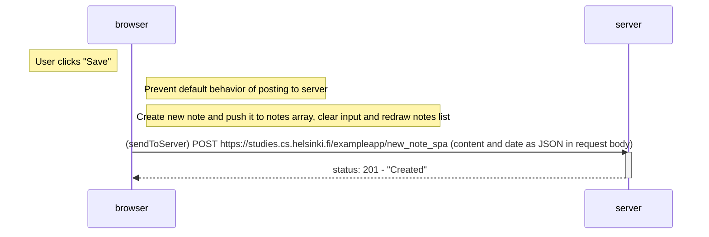

```mermaid
sequenceDiagram
    participant browser
    participant server

    Note left of browser: User clicks "Save"
    Note right of browser: Prevent default behavior of posting to server
    Note right of browser: Create new note and push it to notes array, clear input and redraw notes list
    browser->>server: (sendToServer) POST https://studies.cs.helsinki.fi/exampleapp/new_note_spa (content and date as JSON in request body)
    activate server
    server-->>browser: status: 201 - "Created"
    deactivate server
```
